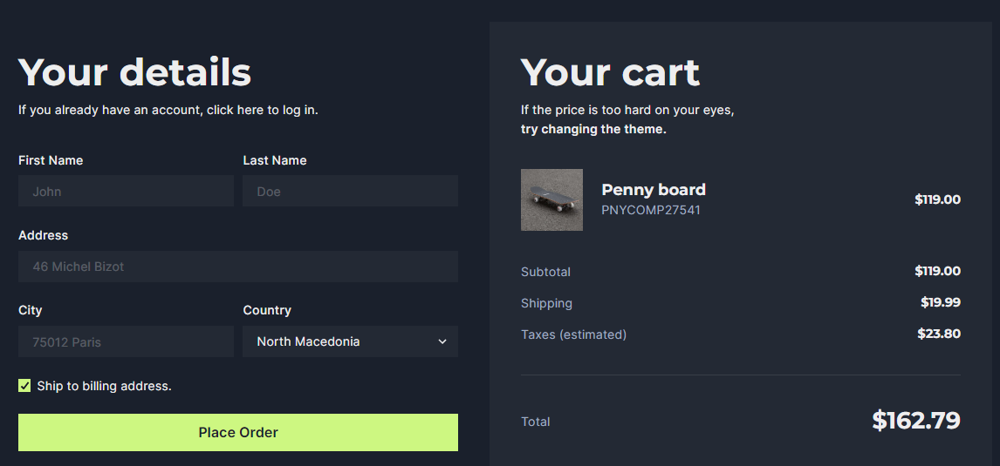

# :rocket:Next Js & Chakra UI & typescript✨

## _:star:This project is inspired by the complete Chakra UI official tutorial:star:_

## Before Getting Started :exclamation:

This is a complete code base created by me to easily refresh our memory in using Chakra UI :gift_heart: with Next JS :sparkler: and how we can easly Override the built-in Component's Styles and Variants :full_moon_with_face:

- Chakra UI is a simple, modular and accessible component library that gives you the building blocks
- Next.js is an open-source web development framework built on top of React
- ✨The Magic of Css in Js ✨

## Getting Started :wink:

First, run the install command to install the package.json file:

```bash
npm install
```

Then run the development server with the following commands:

```bash
npm run dev
# or
yarn dev
```

Open [http://localhost:3000](http://localhost:3000) with your browser to see the result.

## A quick overview of the project :dizzy: :heart:

 

### and a mobile responsive version like so :two_hearts: :


## Can you use this code :question:

Please, feel free to use this project with your own interrest and don't forget to give me a star :heart_eyes: :star:.

## Learn More

To learn more about Next.js, take a look at the following resources:

- [Next.js Documentation](https://nextjs.org/docs) - learn about Next.js features and API.
- [Learn Next.js](https://nextjs.org/learn) - an interactive Next.js tutorial.

You can check out [the Next.js GitHub repository](https://github.com/vercel/next.js/) - your feedback and contributions are welcome!

## Deploy on Vercel

The easiest way to deploy your Next.js app is to use the [Vercel Platform](https://vercel.com/new?utm_medium=default-template&filter=next.js&utm_source=create-next-app&utm_campaign=create-next-app-readme) from the creators of Next.js.

Check out our [Next.js deployment documentation](https://nextjs.org/docs/deployment) for more details.
